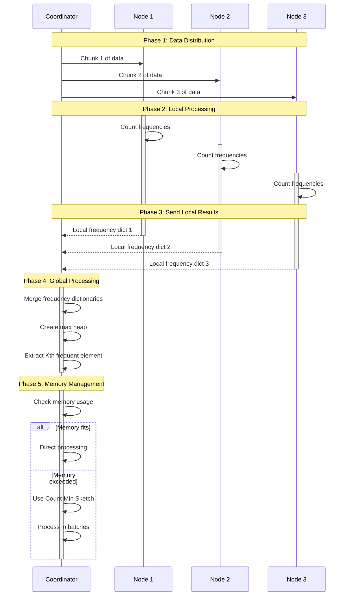
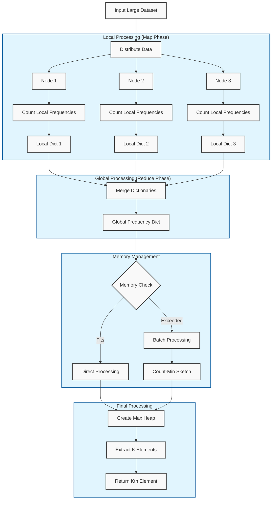

# 🎯 Distributed Kth Frequent Element Finder

A high-performance, distributed system for finding the kth most frequent element in a dataset. Built with Java 21 and designed for scalability and reliability.

## 🚀 Features

- **Distributed Processing**: Efficiently processes large datasets across multiple nodes
- **Memory-Aware**: Intelligent memory management with configurable thresholds per node
- **Fault Tolerant**: Handles node failures and timeouts gracefully
- **Highly Scalable**: Supports dynamic node configuration and load balancing
- **Thread-Safe**: Concurrent processing with proper synchronization
- **Comprehensive Testing**: Extensive test coverage including unit, integration, and stress tests

## 🛠️ Technical Stack

- Java 21 (with preview features)
- Maven for build management
- Lombok for reducing boilerplate
- SLF4J + Logback for logging
- JUnit 5 for testing
- Google Java Format for consistent code style
- Apache Commons & Google Guava utilities

## 📋 Prerequisites

- Java 21 or higher
- Maven 3.8+
- At least 1GB of RAM (configurable based on dataset size)

## 🏗️ Building the Project

```bash
mvn clean install
```

This will:

1. Compile the source code
2. Run the tests
3. Create an executable JAR with dependencies
4. Format the code using Google Java Format

## 🎮 Usage

### Basic Example

```java
// Create a coordinator with 3 nodes and 1MB memory per node
Coordinator coordinator = new Coordinator(3, 1024 * 1024);

// Find the 3rd most frequent element
List<Integer> data = Arrays.asList(9, 9, 6, 9, 8, 6, 8, 6, 4);
int result = coordinator.findKthFrequent(data, 3);

```

### Advanced Configuration

```java
// Configure for large datasets with more nodes
int numNodes = 8;
long memoryPerNode = 2 * 1024 * 1024;// 2MB per node
Coordinator coordinator = new Coordinator(numNodes, memoryPerNode);

// Process millions of records
List<Integer> largeDataset = generateLargeDataset(1_000_000);
int result = coordinator.findKthFrequent(largeDataset, 5);

```

## 🏛️ Architecture

The system consists of three main components:

### 1. Coordinator (Coordinator.java)

- Manages distributed processing workflow
- Handles data partitioning and distribution
- Aggregates results from nodes
- Implements fault tolerance mechanisms

### 2. Processing Nodes (ProcessingNode.java)

- Processes data partitions independently
- Maintains memory usage within thresholds
- Reports processing status and results
- Handles local error recovery

### 3. Data Models

- `DataPartition.java`: Encapsulates data chunks for processing
- `FrequencyPair.java`: Represents element-frequency pairs
- `ProcessingResult.java`: Contains node processing results





## 🧪 Testing

```bash
# Run all tests
mvn test

# Run only unit tests
mvn test -Dtest=*Test

# Run integration tests
mvn verify -P integration-tests

```

Test categories:

- 🎯 Unit Tests: Individual component testing
- 🔄 Integration Tests: End-to-end workflow testing
- 💪 Stress Tests: Performance and stability testing
- 🐛 Edge Cases: Boundary condition testing
- 🔀 Concurrent Tests: Multi-threading scenarios

## 📊 Performance Characteristics

The system is optimized for:

- 📈 Large datasets (millions of records)
- 🔄 Multiple concurrent requests
- 💾 Memory-constrained environments
- 📊 Various data distributions:
    - Normal distribution
    - Skewed data
    - Sparse datasets
    - Power law distribution

## 🚀 Getting Started

1. Clone the repository:

```bash
git clone https://github.com/yourusername/distributed-kth-frequent.git

```

2. Navigate to project directory:

```bash
cd distributed-kth-frequent

```

3. Build the project:

```bash
mvn clean install

```

4. Run the example:

```bash
java -jar target/kth-frequent-1.0-SNAPSHOT-jar-with-dependencies.jar

```
